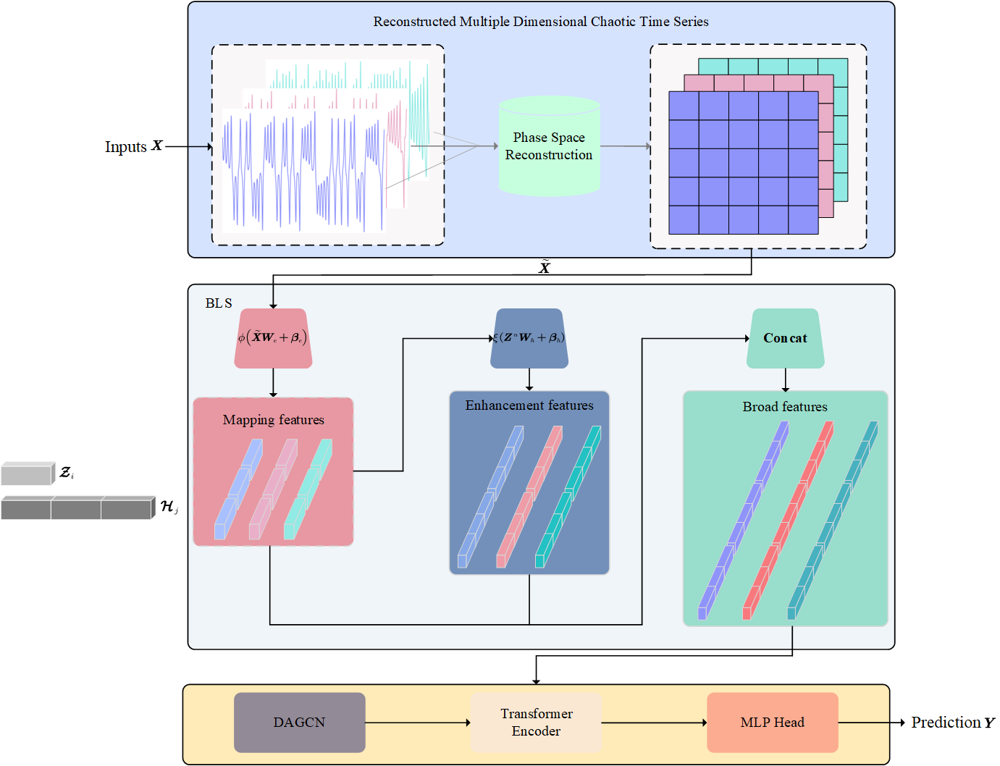
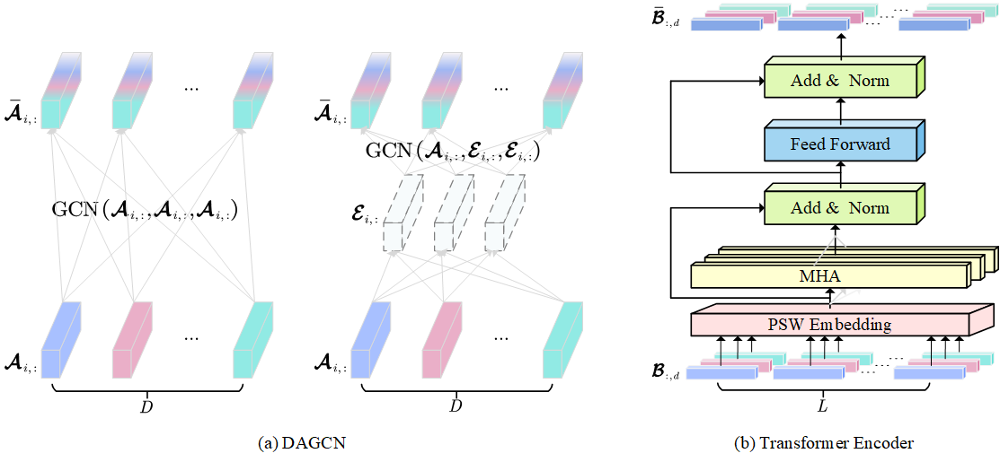
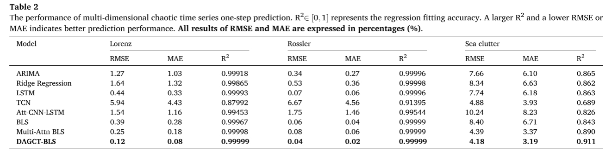

# DAGCT-BLS (Applied Soft Computing 2024)

Dynamic adaptive graph convolutional transformer with broad learning system for multi-dimensional chaotic time series prediction

Chaotic time series data is extensively applied in financial stocks, climate monitoring, and sea clutter. Previous works focus on designing different model frameworks to capture the temporal dependence and extract richer nonlinear features to improve the accuracy of univariate chaotic time series prediction, which ignores the spatial dependence of multivariable. To fill the gap, we innovatively propose a Dynamic Adaptive Graph Convolutional Transformer with a Broad Learning System (DAGCT-BLS), a GCN and Transformer-based model utilizing multivariate spatial dependence for multi-dimensional chaotic time series forecasting [[paper](https://www.sciencedirect.com/science/article/pii/S1568494624002904)].

1. The framwork of DAGCT-BLS

We propose the Dy­namic Adaptive Graph Convolutional Transformer with the Broad Learning System (DAGCT-BLS) model for multivariate chaotic time se­ries forecasting, which consists of three parts: a) Phase space recon­struction of multi-dimensional chaotic time series based on C-C method; b) Broad Learning System for chaotic characteristics and nonlinear features extraction; c) Dynamic Adaptive Graph Convolutional Network (DAGCN) for multivariate spatial dependence modeling and Trans­former Encoder for chaotic temporal sequence dependence modeling.



<div align="center">
Fig. 1 The framework of DAGCT-BLS.
</div>

2. Dynamic Adaptive Graph Convolutional Network (DAGCN) & Transformer encoder with phase-segment-wise embedding

In this paper, we try to use GCN to capture the spatial dependence of chaotic time series in different variables. Unfortunately, for the multi-dimensional chaotic time series, there isn't a priori adjacency matrix. Inspired by Node Adaptive Parameter Learning, we design a dynamic adaptive graphical convolu­tional network (DAGCN) to learn the spatial correlation of different variables in phase space. In addition, we capture the temporal dependence of multiple phase points using Transformers multi-head attention (MHA).



<div align="center">
Fig. 2 The submodules’ structure of DAGCT-BLS.
</div>

## Main Results

DAGCT-BLS can achieve the best prediction performance and have strong interpretability with **40%~90%** **relative improvement** on seven benchmarks, covering two theoretical chaotic datasets (Lorenz, Rossler) and one real-word chaotic dataset (Sea clutter).



## Get Started

1. Install Python 3.7, Pytorch 1.11.0, and Cuda 11.5
2. Download data and use Matlab or Python to reconstruct data. You can download the original three choatic dataset from [Google Drive](https://drive.google.com/drive/folders/1mYoxIYTuIdfbE5y_OfHVWk4cDqMt42Mb?usp=sharing)
3. Train and test the model

```cmd
git clone git@github.com:cquxl/DAGCT-BLS.git
cd DAGCT-BLS
python main.py
```

## Baselines

We will keep adding chaotic time series forcasting models to expand this repo:

- [X] DAGCT-BLS
- [X] Multi-Attn BLS
- [X] BLS

## Citation

If you find this repo useful, please cite our paper.

```
@article{Xiong2024DynamicAG,
      title={Dynamic adaptive graph convolutional transformer with broad learning system for multi-dimensional chaotic time series prediction},
      author={Lang Xiong and Liyun Su and Xiaoyi Wang and Chunquan Pan},
      journal={Applied Soft Computing},
      year={2024},
      volume={157},
      pages={111516}
      }
```

## Contact

If you have any questions or want to use the code, please contact xionglang@stu.cqut.edu.cn
